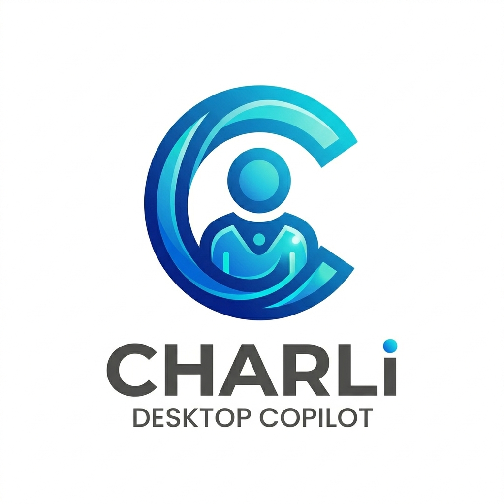

<div align="center">
  
  <h1>Charli — Desktop Copilot</h1>
  <p>A fully local, privacy-first AI assistant for your laptop.<br/>
  No cloud. No API keys. No subscriptions. Everything runs on your machine.</p>

  
  
  
  
</div>

---

## What is Charli?

Charli is a personal AI copilot that runs **100% locally** on your laptop.
It combines voice assistant, coding helper, task manager, file manager,
web search, translator and desktop automation into one clean desktop app.

---

## Features

| Feature | Description |
|---|---|
| 💬 **Chat** | Persistent multi-session chat with memory across restarts |
| 🎤 **Voice** | Speak naturally — Whisper transcribes, Ollama replies, pyttsx3 speaks back |
| 🌍 **Multilingual** | English, Hindi, Bengali, Odia, French — voice and text |
| 🌐 **Translator** | Translate between 130+ languages with text + speech output |
| ✅ **Tasks** | Create, complete, filter tasks by voice or text |
| 📝 **Notes** | Write and search notes with tags |
| 📅 **Calendar** | Monthly view, add and manage events |
| ⏰ **Reminders** | Natural language reminders with desktop notifications |
| 💻 **Code** | Write, debug, explain, review, optimize code in 20+ languages |
| 📁 **Files** | Browse, search, open, rename files by voice or text |
| 🔍 **Web Search** | DuckDuckGo search with AI summarisation |
| 🤖 **Automation** | Open apps, type text, screenshot, volume, clipboard, run commands |
| 🧠 **Memory** | LangChain persistent memory — Charli remembers across sessions |
| 🔔 **Wake Word** | Say "Hey Jarvis" — Charli activates hands-free |
| ⌨️ **Global Hotkey** | Ctrl+Space opens Charli from any app |
| 🖥️ **System Tray** | Runs silently in background, always available |
| 🌙 **Themes** | Dark, Light, System default |

---

## Tech Stack

| Layer | Technology |
|---|---|
| Desktop Shell | Electron |
| Backend Engine | Python + FastAPI |
| AI Brain | Ollama (LLaMA 3.2 / Mistral) |
| Voice Input | OpenAI Whisper (local) |
| Voice Output | pyttsx3 (offline) |
| Wake Word | OpenWakeWord (local) |
| Memory | LangChain + SQLite |
| Automation | PyAutoGUI |
| Web Search | DuckDuckGo (no API key) |
| Database | SQLite |
| Icons | Lucide |

---

## Prerequisites

- Windows 10/11
- Python 3.11+
- Node.js 18+ (LTS)
- [Ollama](https://ollama.com) installed

---

## Setup

### 1. Clone the repo

```bash
git clone https://github.com/YOUR_USERNAME/charli.git
cd charli
```

### 2. Python environment

```bash
python -m venv venv
venv\Scripts\activate
pip install -r requirements.txt
```

### 3. Install Ollama and pull a model

```bash
# Install from https://ollama.com
ollama pull llama3.2
```

### 4. Install Electron dependencies

```bash
cd electron
npm install
cd ..
```

### 5. Download wake word model

```bash
python -c "from openwakeword.model import Model; Model(wakeword_models=['hey_jarvis'], inference_framework='onnx')"
```

---

## Running Charli

**Terminal 1 — Python backend:**
```bash
cd python
python main.py
```

**Terminal 2 — Electron UI:**
```bash
cd electron
npm start
```

---

## Usage

| Action | How |
|---|---|
| Open from anywhere | `Ctrl+Space` |
| Voice activate | Say **"Hey Jarvis"** |
| Send message | Type + `Enter` |
| Voice chat | Click mic button 🎤 |
| New chat | Click `+ New` in sidebar |
| Switch panels | Click sidebar icons |

---

## Project Structure

charli/
├── python/                  # Python AI backend
│   ├── main.py              # FastAPI entry point
│   ├── config.py            # Configuration
│   ├── database.py          # SQLite setup
│   ├── ai/                  # Ollama + memory
│   ├── voice/               # Whisper + TTS + wake word
│   ├── modules/             # Features (tasks, notes, files...)
│   └── routes/              # API endpoints
├── electron/                # Electron UI shell
│   ├── main.js              # Main process
│   ├── preload.js           # IPC bridge
│   └── renderer/            # Frontend (HTML/CSS/JS)
├── assets/                  # Icons and images
├── data/                    # SQLite database (gitignored)
├── requirements.txt         # Python dependencies
└── README.md

---

## Requirements.txt

Generate with:
```bash
pip freeze > requirements.txt
```

---

## Privacy

Everything runs locally on your machine:
- No data sent to any server
- No API keys required
- No internet needed (except web search feature)
- All conversations stored in local SQLite only

---

## License

MIT License — free to use, modify and distribute.

---

## Author

Built by **Aniruddha** — a solo project from scratch.